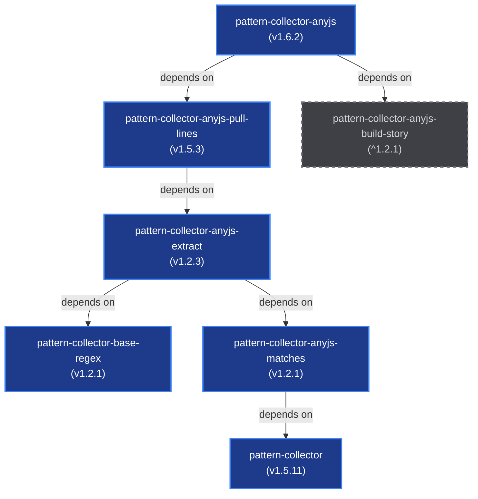

# Workspace Repositories Dependency Analysis (AnyJS Suite)

This document provides a comprehensive overview of the JavaScript/npm repositories present in this workspace, their relationships, and their dependency topology.

---

## 1. Dependency Topology Graph

Below is the dependency graph showing how the packages in the `anyjs` suite are interconnected.

- **Solid blue nodes:** Packages present in this local workspace.
- **Dashed gray nodes:** External npm dependencies not present as folders in this workspace.

---

## 2. Workspace Packages Directory

There are **6 repositories** currently loaded in the workspace. Below is a detailed listing of each package, its current version, description, and internal/external dependencies.

| Repository Folder | NPM Package Name | Version | Description | Workspace Dependencies |
| :--- | :--- | :--- | :--- | :--- |
| [pattern-collector](file:///d:/KeshavSoftRepos/2026-07-23(2)/pattern-collector) | `pattern-collector` | `1.5.11` | A high-performance pattern collector and ESM import statement analyzer. | None |
| [pattern-collector-anyjs](file:///d:/KeshavSoftRepos/2026-07-23(2)/pattern-collector-anyjs) | `pattern-collector-anyjs` | `1.6.2` | Pull lines and build story for any JS from supplied regex. | [pattern-collector-anyjs-pull-lines](file:///d:/KeshavSoftRepos/2026-07-23(2)/pattern-collector-anyjs-pull-lines) (`^1.5.3`) |
| [pattern-collector-anyjs-extract](file:///d:/KeshavSoftRepos/2026-07-23(2)/pattern-collector-anyjs-extract) | `pattern-collector-anyjs-extract` | `1.2.3` | A high-performance pattern collector and ESM import statement analyzer. | [pattern-collector-anyjs-matches](file:///d:/KeshavSoftRepos/2026-07-23(2)/pattern-collector-anyjs-matches) (`^1.2.1`)   [pattern-collector-base-regex](file:///d:/KeshavSoftRepos/2026-07-23(2)/pattern-collector-base-regex) (`^1.2.1`) |
| [pattern-collector-anyjs-matches](file:///d:/KeshavSoftRepos/2026-07-23(2)/pattern-collector-anyjs-matches) | `pattern-collector-anyjs-matches` | `1.2.1` | Get all matches from regex. | [pattern-collector](file:///d:/KeshavSoftRepos/2026-07-23(2)/pattern-collector) (`^1.5.11`) |
| [pattern-collector-anyjs-pull-lines](file:///d:/KeshavSoftRepos/2026-07-23(2)/pattern-collector-anyjs-pull-lines) | `pattern-collector-anyjs-pull-lines` | `1.5.3` | Pull lines from content using supplied regex. | [pattern-collector-anyjs-extract](file:///d:/KeshavSoftRepos/2026-07-23(2)/pattern-collector-anyjs-extract) (`^1.2.3`) |
| [pattern-collector-base-regex](file:///d:/KeshavSoftRepos/2026-07-23(2)/pattern-collector-base-regex) | `pattern-collector-base-regex` | `1.2.1` | A high-performance pattern collector and ESM import statement analyzer. | None |

> [!NOTE]
> The dependency `pattern-collector-anyjs-build-story` referenced by `pattern-collector-anyjs` is an external dependency and is not present locally in this workspace.

---

## 3. Package Configurations

You can inspect the configuration files for each package directly:

- **pattern-collector:** [package.json](file:///d:/KeshavSoftRepos/2026-07-23(2)/pattern-collector/package.json)
- **pattern-collector-anyjs:** [package.json](file:///d:/KeshavSoftRepos/2026-07-23(2)/pattern-collector-anyjs/package.json)
- **pattern-collector-anyjs-extract:** [package.json](file:///d:/KeshavSoftRepos/2026-07-23(2)/pattern-collector-anyjs-extract/package.json)
- **pattern-collector-anyjs-matches:** [package.json](file:///d:/KeshavSoftRepos/2026-07-23(2)/pattern-collector-anyjs-matches/package.json)
- **pattern-collector-anyjs-pull-lines:** [package.json](file:///d:/KeshavSoftRepos/2026-07-23(2)/pattern-collector-anyjs-pull-lines/package.json)
- **pattern-collector-base-regex:** [package.json](file:///d:/KeshavSoftRepos/2026-07-23(2)/pattern-collector-base-regex/package.json)
