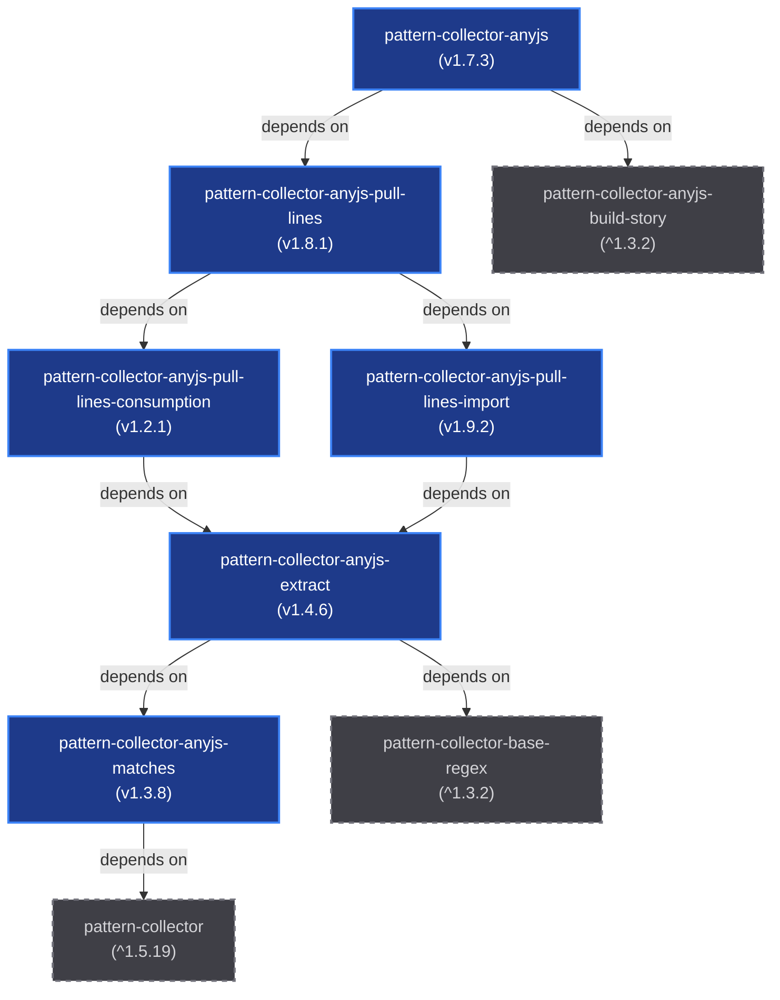

# Workspace Repositories Dependency Analysis (AnyJS Suite)

This document provides a comprehensive overview of the JavaScript/npm repositories present in this workspace, their relationships, and their dependency topology.

---

## 1. Dependency Topology Graph

Below is the dependency graph showing how the packages in the `anyjs` suite are interconnected.

- **Solid blue nodes:** Packages present in this local workspace.
- **Dashed gray nodes:** External npm dependencies not present as folders in this workspace.

```mermaid
graph TD
    classDef default fill:#1f2937,stroke:#374151,stroke-width:1px,color:#f3f4f6;
    classDef active fill:#1e3a8a,stroke:#3b82f6,stroke-width:2px,color:#ffffff;
    classDef external fill:#3f3f46,stroke:#71717a,stroke-width:2px,color:#d4d4d8,stroke-dasharray: 5 5;

    %% Nodes
    PCAJ["pattern-collector-anyjs<br>(v1.7.3)"]:::active
    PCAJPL["pattern-collector-anyjs-pull-lines<br>(v1.8.1)"]:::active
    PCAJPLC["pattern-collector-anyjs-pull-lines-consumption<br>(v1.2.1)"]:::active
    PCAJPLI["pattern-collector-anyjs-pull-lines-import<br>(v1.9.2)"]:::active
    PCAJE["pattern-collector-anyjs-extract<br>(v1.4.6)"]:::active
    PCAJM["pattern-collector-anyjs-matches<br>(v1.3.8)"]:::active
    
    %% External Nodes
    PCAJBS["pattern-collector-anyjs-build-story<br>(^1.3.2)"]:::external
    PCBR["pattern-collector-base-regex<br>(^1.3.2)"]:::external
    PC["pattern-collector<br>(^1.5.19)"]:::external

    %% Edges
    PCAJ -->|depends on| PCAJBS
    PCAJ -->|depends on| PCAJPL
    
    PCAJPL -->|depends on| PCAJPLC
    PCAJPL -->|depends on| PCAJPLI
    
    PCAJPLC -->|depends on| PCAJE
    PCAJPLI -->|depends on| PCAJE
    
    PCAJE -->|depends on| PCAJM
    PCAJE -->|depends on| PCBR
    
    PCAJM -->|depends on| PC
```

---

## 2. Workspace Packages Directory

There are **6 repositories** currently loaded in the workspace. Below is a detailed listing of each package, its current version, description, and internal/external dependencies.

| Repository Folder | NPM Package Name | Version | Description | Workspace Dependencies |
| :--- | :--- | :--- | :--- | :--- |
| [pattern-collector-anyjs](file:///d:/KeshavSoftRepos/2026-07-24/ks2/pattern-collector-anyjs) | `pattern-collector-anyjs` | `1.7.3` | Pull lines and build story for any JS from supplied regex. | [pattern-collector-anyjs-pull-lines](file:///d:/KeshavSoftRepos/2026-07-24/ks2/pattern-collector-anyjs-pull-lines) (`^1.8.1`) |
| [pattern-collector-anyjs-pull-lines](file:///d:/KeshavSoftRepos/2026-07-24/ks2/pattern-collector-anyjs-pull-lines) | `pattern-collector-anyjs-pull-lines` | `1.8.1` | Pull lines from content using supplied regex. | [pattern-collector-anyjs-pull-lines-consumption](file:///d:/KeshavSoftRepos/2026-07-24/ks2/pattern-collector-anyjs-pull-lines-consumption) (`^1.2.1`)   [pattern-collector-anyjs-pull-lines-import](file:///d:/KeshavSoftRepos/2026-07-24/ks2/pattern-collector-anyjs-pull-lines-import) (`^1.9.2`) |
| [pattern-collector-anyjs-pull-lines-consumption](file:///d:/KeshavSoftRepos/2026-07-24/ks2/pattern-collector-anyjs-pull-lines-consumption) | `pattern-collector-anyjs-pull-lines-consumption` | `1.2.1` | Scans target source files to locate route consumption declarations and mount path registrations. | [pattern-collector-anyjs-extract](file:///d:/KeshavSoftRepos/2026-07-24/ks2/pattern-collector-anyjs-extract) (`^1.4.6`) |
| [pattern-collector-anyjs-pull-lines-import](file:///d:/KeshavSoftRepos/2026-07-24/ks2/pattern-collector-anyjs-pull-lines-import) | `pattern-collector-anyjs-pull-lines-import` | `1.9.2` | Scans target source files to locate route module import declarations and their original file paths. | [pattern-collector-anyjs-extract](file:///d:/KeshavSoftRepos/2026-07-24/ks2/pattern-collector-anyjs-extract) (`^1.4.6`) |
| [pattern-collector-anyjs-extract](file:///d:/KeshavSoftRepos/2026-07-24/ks2/pattern-collector-anyjs-extract) | `pattern-collector-anyjs-extract` | `1.4.6` | A high-performance pattern extractor that scans text files and extracts structured group details from matches. | [pattern-collector-anyjs-matches](file:///d:/KeshavSoftRepos/2026-07-24/ks2/pattern-collector-anyjs-matches) (`^1.3.8`)   `pattern-collector-base-regex` (external, `^1.3.2`) |
| [pattern-collector-anyjs-matches](file:///d:/KeshavSoftRepos/2026-07-24/ks2/pattern-collector-anyjs-matches) | `pattern-collector-anyjs-matches` | `1.3.8` | Safe wrapper helper. Safely queries matching occurrences for RegExp filters in files while gracefully handling potential parse anomalies. | `pattern-collector` (external, `^1.5.19`) |

> [!NOTE]
> The dependencies `pattern-collector-anyjs-build-story`, `pattern-collector-base-regex`, and `pattern-collector` are external dependencies and are not present locally in this workspace folder.

---

## 3. Package Configurations

You can inspect the configuration files for each package directly:

- **pattern-collector-anyjs:** [package.json](file:///d:/KeshavSoftRepos/2026-07-24/ks2/pattern-collector-anyjs/package.json)
- **pattern-collector-anyjs-pull-lines:** [package.json](file:///d:/KeshavSoftRepos/2026-07-24/ks2/pattern-collector-anyjs/package.json)
- **pattern-collector-anyjs-pull-lines-consumption:** [package.json](file:///d:/KeshavSoftRepos/2026-07-24/ks2/pattern-collector-anyjs-pull-lines-consumption/package.json)
- **pattern-collector-anyjs-pull-lines-import:** [package.json](file:///d:/KeshavSoftRepos/2026-07-24/ks2/pattern-collector-anyjs-pull-lines-import/package.json)
- **pattern-collector-anyjs-extract:** [package.json](file:///d:/KeshavSoftRepos/2026-07-24/ks2/pattern-collector-anyjs-extract/package.json)
- **pattern-collector-anyjs-matches:** [package.json](file:///d:/KeshavSoftRepos/2026-07-24/ks2/pattern-collector-anyjs-matches/package.json)
