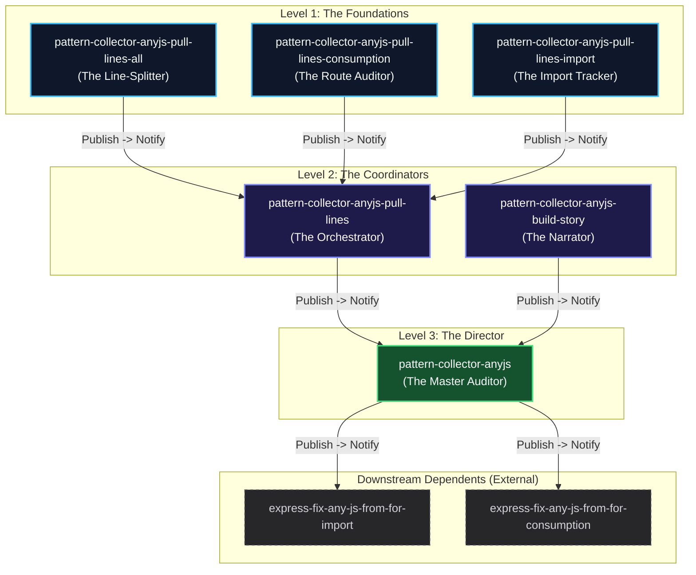

# The AnyJS Pattern Collector Ecosystem: A Dependency Story

This document tells the story of the **6 related repositories** in this workspace, explaining their roles, how they are connected, and how changes cascade through the NPM publish and notification pipeline.

---

## 1. The Cast (The Six Repositories)

The ecosystem is structured in three logical layers: the core foundation extractors, the coordinators, and the top-level director.

### Layer 1: The Foundations (Core Sub-Modules)
These packages are zero-dependency utilities focusing on specific static analysis tasks. They only rely on the external package `pattern-collector-anyjs-extract` (`^1.4.6`).

*   **[pattern-collector-anyjs-pull-lines-all](file:///d:/KeshavSoftRepos/2026-07-25(4)/pattern-collector-anyjs-pull-lines-all)**: The **Line-Splitter**. It splits JavaScript source code by lines and generates 1-indexed line numbers to create the baseline "story".
*   **[pattern-collector-anyjs-pull-lines-consumption](file:///d:/KeshavSoftRepos/2026-07-25(4)/pattern-collector-anyjs-pull-lines-consumption)**: The **Route Auditor**. It scans Express route files to identify mount path registrations (like `router.use("/api", ...)`).
*   **[pattern-collector-anyjs-pull-lines-import](file:///d:/KeshavSoftRepos/2026-07-25(4)/pattern-collector-anyjs-pull-lines-import)**: The **Import Tracker**. It scans files to find ES module imports and their original file paths.

### Layer 2: The Coordinators (Intermediary Modules)
These packages bring together the foundations to compile data.

*   **[pattern-collector-anyjs-pull-lines](file:///d:/KeshavSoftRepos/2026-07-25(4)/pattern-collector-anyjs-pull-lines)**: The **Orchestrator**. It wraps the three Level 1 packages (`pull-lines-all`, `pull-lines-consumption`, and `pull-lines-import`) to offer a unified interface to scan files and extract structured code mappings.
*   **[pattern-collector-anyjs-build-story](file:///d:/KeshavSoftRepos/2026-07-25(4)/pattern-collector-anyjs-build-story)**: The **Narrator**. It builds the JSON verification story by mapping imported modules to their route registrations.

### Layer 3: The Director (Top-Level Wrapper)
*   **[pattern-collector-anyjs](file:///d:/KeshavSoftRepos/2026-07-25(4)/pattern-collector-anyjs)**: The **Master Auditor**. It cross-references imports against Express router registrations to generate reports on unused route imports or missing route files.

---

## 2. The Narrative of Publication & Propagation

When a change is introduced, it propagates through the dependency tree via automated GitHub Actions:

### Step 1: Upstream Updates & Manual Release
A developer updates one of the core sub-modules (e.g. `pull-lines-import`) and triggers its `NPM Check, Publish and Notify` action.

### Step 2: Verification & NPM Publish
The sub-module's workflow compares its local version with NPM:
*   If a new version is detected, it executes `npm publish`.
*   Once published, it sends a `repository_dispatch` to notify the intermediate coordinator (`pull-lines`).

### Step 3: Cascade to the Orchestrator
When `pattern-collector-anyjs-pull-lines` receives the update dispatch:
1.  Its `Update Dependency` workflow runs `npm install ...@latest` on all sub-modules.
2.  If changes are detected, it updates its `package.json`, bumps its version, commits & pushes to main, and publishes itself to NPM.
3.  Once published, it dispatches a notification to the top-level repo (`pattern-collector-anyjs`).

### Step 4: Cascade to the Director
When `pattern-collector-anyjs` receives the update dispatch:
1.  Its workflow installs the latest `pull-lines` and `build-story` packages.
2.  If changes are found, it bumps its version, pushes to main, publishes to NPM, and sends dispatches to downstream external consumers: `express-fix-any-js-from-for-import` and `express-fix-any-js-from-for-consumption`.

---

## 3. GitHub Actions & Registry Panel

Below is the directory mapping of the 6 workspace packages, along with quick links to run their publish actions and see their next notification targets.

| Repository Folder | NPM Package Name | NPM Publish Workflow (New Tab) | Next Notification Target (New Tab) |
| :--- | :--- | :--- | :--- |
| 1. [pattern-collector-anyjs-pull-lines-all](file:///d:/KeshavSoftRepos/2026-07-25(4)/pattern-collector-anyjs-pull-lines-all) | `pattern-collector-anyjs-pull-lines-all` | <a href="https://github.com/keshavsoft/pattern-collector-anyjs-pull-lines-all/actions/workflows/publish-conditional.yml" target="_blank">Run Publish Action</a> | <a href="https://github.com/keshavsoft/pattern-collector-anyjs-pull-lines/actions" target="_blank">pattern-collector-anyjs-pull-lines</a> |
| 2. [pattern-collector-anyjs-pull-lines-consumption](file:///d:/KeshavSoftRepos/2026-07-25(4)/pattern-collector-anyjs-pull-lines-consumption) | `pattern-collector-anyjs-pull-lines-consumption` | <a href="https://github.com/keshavsoft/pattern-collector-anyjs-pull-lines-consumption/actions/workflows/publish-conditional.yml" target="_blank">Run Publish Action</a> | <a href="https://github.com/keshavsoft/pattern-collector-anyjs-pull-lines/actions" target="_blank">pattern-collector-anyjs-pull-lines</a> |
| 3. [pattern-collector-anyjs-pull-lines-import](file:///d:/KeshavSoftRepos/2026-07-25(4)/pattern-collector-anyjs-pull-lines-import) | `pattern-collector-anyjs-pull-lines-import` | <a href="https://github.com/keshavsoft/pattern-collector-anyjs-pull-lines-import/actions/workflows/publish-conditional.yml" target="_blank">Run Publish Action</a> | <a href="https://github.com/keshavsoft/pattern-collector-anyjs-pull-lines/actions" target="_blank">pattern-collector-anyjs-pull-lines</a> |
| 4. [pattern-collector-anyjs-pull-lines](file:///d:/KeshavSoftRepos/2026-07-25(4)/pattern-collector-anyjs-pull-lines) | `pattern-collector-anyjs-pull-lines` | <a href="https://github.com/keshavsoft/pattern-collector-anyjs-pull-lines/actions/workflows/publish-conditional.yml" target="_blank">Run Publish Action</a> | <a href="https://github.com/keshavsoft/pattern-collector-anyjs/actions" target="_blank">pattern-collector-anyjs</a> |
| 5. [pattern-collector-anyjs-build-story](file:///d:/KeshavSoftRepos/2026-07-25(4)/pattern-collector-anyjs-build-story) | `pattern-collector-anyjs-build-story` | <a href="https://github.com/keshavsoft/pattern-collector-anyjs-build-story/actions/workflows/publish-conditional.yml" target="_blank">Run Publish Action</a> | <a href="https://github.com/keshavsoft/pattern-collector-anyjs/actions" target="_blank">pattern-collector-anyjs</a> |
| 6. [pattern-collector-anyjs](file:///d:/KeshavSoftRepos/2026-07-25(4)/pattern-collector-anyjs) | `pattern-collector-anyjs` | <a href="https://github.com/keshavsoft/pattern-collector-anyjs/actions/workflows/publish-conditional.yml" target="_blank">Run Publish Action</a> | <a href="https://github.com/keshavsoft/express-fix-any-js-from-for-import/actions" target="_blank">express-fix-any-js-from-for-import</a> &   <a href="https://github.com/keshavsoft/express-fix-any-js-from-for-consumption/actions" target="_blank">express-fix-any-js-from-for-consumption</a> |
